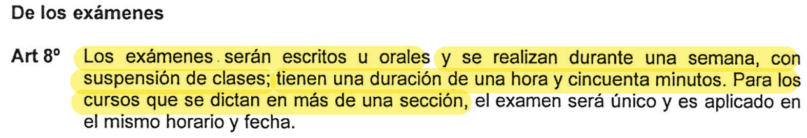
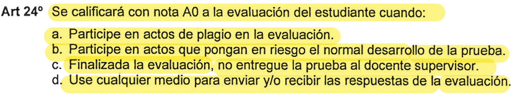
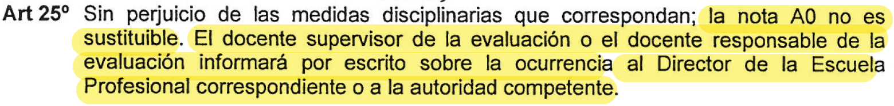
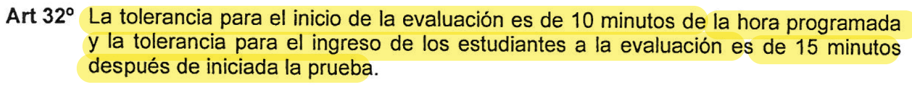
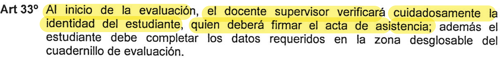
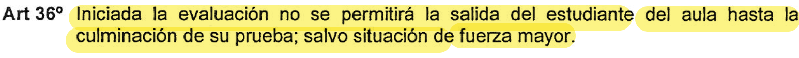

# BIC01 — Introducción a la Computación - 2026 -I

---
## Sílabo Calendarizado 

### PARTE 1 — Fundamentos (Semanas 1–7)

| Semana | Fechas | Teoría | Práctica | Evaluación |
|--------|--------|--------|----------|------------|
| [**01**](./semana-01/) | Mar 23–28 | Introducción al sistema informático. Hardware vs Software. Lenguajes de alto y bajo nivel. Intro a C++. | Instalación y uso de **PseInt** y **VS Code** | — |
| [**02**](./semana-02/) | Mar 30–Abr 05 | Diagramas de flujo y pseudocódigo. Definición y representación de algoritmos. | 1ra Práctica Dirigida (Semana 1) | — |
| [**03**](./semana-03/) | Abr 06–11 | Variables y procesos secuenciales. Operadores aritméticos, relacionales y lógicos. Tipos de datos. Números aleatorios. | 2da Práctica Dirigida (Semanas 2 y 3) | — |
| [**04**](./semana-04/) | Abr 13–18 | Estructuras de control: `if` simple y `if...else`. Diagrama de flujo, pseudocódigo y código C++. |  **1ra Práctica Calificada** (Semanas 1–3) |  1ra Calificada |
| [**05**](./semana-05/) | Abr 20–25 | Estructuras de control: `switch` y `do-while`. Diagrama de flujo, pseudocódigo y código C++. | 3ra Práctica Dirigida (Semana 5) | — |
| [**06**](./semana-06/) | Abr 27–May 02 | Estructuras de control: `while` y `for`. Diagrama de flujo, pseudocódigo y código C++. | 4ta Práctica Dirigida (Semana 6) | — |
| [**07**](./semana-07/) | May 04–09 | Estructuras de control anidadas. |  **2da Práctica Calificada** (Semanas 4–6) |  2da Calificada |

---

### EXAMEN PARCIAL

| Semana | Fechas | Contenido |
|--------|--------|-----------|
| [**08**](./semana-08/) | May 11–16 |  **Examen Parcial** — cubre Semanas 1 a 7 |

---

###  PARTE 2 — Arreglos y Funciones (Semanas 9–15)

| Semana | Fechas | Teoría | Práctica | Evaluación |
|--------|--------|--------|----------|------------|
| [**09**](./semana-09/) | May 18–23 | Arreglos unidimensionales (Vectores). Definición, operaciones básicas y método de ordenamiento. | 5ta Práctica Dirigida (Semana 9) | — |
| [**10**](./semana-10/) | May 25–30 | Arreglos bidimensionales (Matrices). Operaciones básicas. Búsqueda secuencial y binaria. | 6ta Práctica Dirigida (Semana 10) | — |
| [**11**](./semana-11/) | Jun 01–06 | Introducción a funciones. Funciones predefinidas y definidas por el usuario. |  **3ra Práctica Calificada** (Semanas 9–10) |  3ra Calificada |
| [**12**](./semana-12/) | Jun 08–13 | Funciones sin parámetros, con parámetros y funciones `void`. | 7ma Práctica Dirigida (Semanas 11 y 12) | — |
| [**13**](./semana-13/) | Jun 15–20 | Funciones recursivas. Definición y aplicaciones. | 8va Práctica Dirigida (Semana 13) | — |
| [**14**](./semana-14/) | Jun 22–27 | Cadenas de caracteres (`string`). Librería `<string>` y ejemplos de aplicación. | 9na Práctica Dirigida (Semana 14) | — |
| [**15**](./semana-15/) | Jun 29–Jul 04 |  **Exposición, entrega de Trabajos de Fin de Curso o repaso** |  **4ta Práctica Calificada** (Semanas 11–14) |  4ta Calificada |

---

### EXÁMENES FINALES

| Semana | Fechas | Contenido |
|--------|--------|-----------|
| [**16**](./semana-16/) | Jul 06–11 |  **Examen Final** — cubre Semanas 9 a 15 |
| [**17**](./semana-17/) | Jul 13–18 |  **Examen Sustitutorio** — cubre Semanas 1 a 15 |

---

##  Herramientas del Curso

| Herramienta | Uso | Descarga |
|-------------|-----|----------|
|  | Lenguaje principal del curso | — |
| **PseInt** | Diagramas de flujo y pseudocódigo | [pseint.sourceforge.net](http://pseint.sourceforge.net/) |
| **VS Code** | IDE principal para C++ | [code.visualstudio.com](https://code.visualstudio.com/) |
| **MinGW / GCC** | Compilador C++ para Windows | [winlibs.com](https://winlibs.com/) |

---

##  Sistema de Evaluación

```
Prácticas Calificadas (4)  ──────────────  25%
Examen Parcial             ──────────────  25%
Examen Final               ──────────────  50%
```

> Es obligatorio asistir puntualmente a todas las clases y evaluaciones. Se adjuntan algunos artículos de la Resolución Rectoral N.° 0116, los cuales deberán ser respetados durante todo el ciclo académico. 











---

<!--
## 📂 ¿Cómo usar este repositorio?

```bash
# Clona el repositorio
git clone https://github.com/TU_USUARIO/BIC01-2025-1.git

# Entra a la semana que corresponda
cd BIC01-2025-1/semana-03/

# Compila un archivo C++
g++ -o programa main.cpp
./programa
```

---

##  Contribuciones

Este es un repositorio del curso. Si encuentras un error en algún ejemplo o quieres proponer una mejora:

1. Haz un **fork** del repositorio
2. Crea una rama: `git checkout -b fix/semana-05-typo`
3. Realiza tus cambios y haz commit: `git commit -m "Fix: corrección en ejemplo do-while"`
4. Abre un **Pull Request**

---

-->
