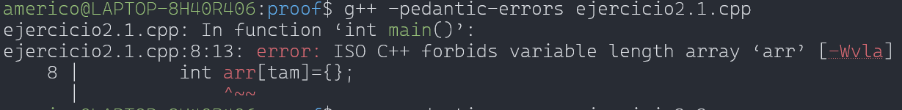
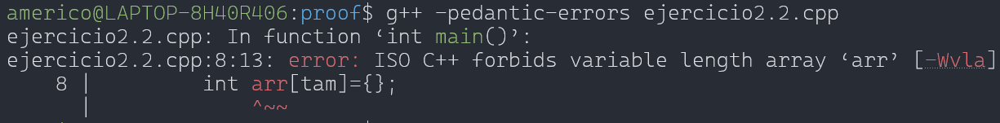
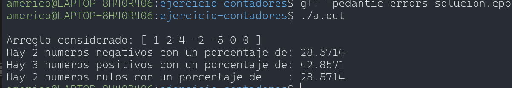

# Retroalimentación – Ejercicio de conteo de enteros
Crea un programa que reciba un arreglo de números enteros y determine cuántos son
positivos, cuántos negativos y cuántos son nulos. Muestra también el porcentaje de
cada tipo respecto al total.

## Lo positivo

Las tres soluciones muestran que entendiste correctamente la lógica del problema:

* recorrer datos,
* clasificar positivos, negativos y nulos,
* calcular porcentajes.

Eso es importante y está bien encaminado.

---

## El problema técnico encontrado

En las soluciones `ejercicio2.1.cpp` y `ejercicio2.2.cpp` aparece este código:

```cpp
int arr[tam];
```

Aunque algunos compiladores lo aceptan, **esto NO pertenece al estándar ISO C++.**

El tamaño de un arreglo tradicional debe conocerse en tiempo de compilación.

Por eso, el compilador (que respeta el Estándar C++) reporta:




---

## ¿Por qué esto importa?

Porque en programación profesional no basta con que el programa “funcione en mi computadora”.

El código debe:

* seguir el estándar,
* ser portable,
* compilar en distintos entornos,
* y comportarse de manera predecible.

---

## La forma correcta

Es la solucion `ejercicio2.cpp`, en el curso, los arreglos deben tener tamaño fijo.

Note que, el ejercicio no pedía:
* solicitar datos al usuario,
* pedir el tamaño del arreglo,
* ni usar valores centinela para terminar la entrada.

El problema solo requería trabajar con un arreglo ya definido, por ello la solución `ejercicio2.cpp` adecuada sería:

```cpp
#include <iostream>
using namespace std;

int main (){
    int arr[] = {1, 2, 4, -2, -5, 0, 0}; // El campilador conoce que el tamaño del arreglo es 7 (fijo)
	int contadort = sizeof(arr)/sizeof(arr[0]); // uso la variable contadort para que almacene 7
	
	int contadorn=0;
	int contadorp=0;
	int contadornull=0;

	// Mostramos el arreglo considerado
	cout << "\nArreglo considerado: " << "[ ";
	for (int i = 0; i < contadort; ++i) {
		cout << arr[i] << " "; 
	}
	cout << "]" << endl;
	
	
	for (int i=0;i<contadort; i++){	
		//condicionales
		if (arr[i]<0){
			contadorn++;
		}
		else if (arr[i]>0){
			contadorp++;
		}
		else{
			contadornull++;
		}
	}
	
	//porcentaje
	double porcentajen=(contadorn*1.0/contadort)*100;
	double porcentajep=(contadorp*1.0/contadort)*100;
	double porcentajenull=(contadornull*1.0/contadort)*100;
	
	cout<<"Hay "<<contadorn<<" numeros negativos con un porcentaje de: "<<porcentajen<<endl;
	cout<<"Hay "<<contadorp<<" numeros positivos con un porcentaje de: "<<porcentajep<<endl;
	cout<<"Hay "<<contadornull<<" numeros nulos con un porcentaje de: "<<porcentajenull <<endl;	

	return 0;
}
```
**Salida:**


